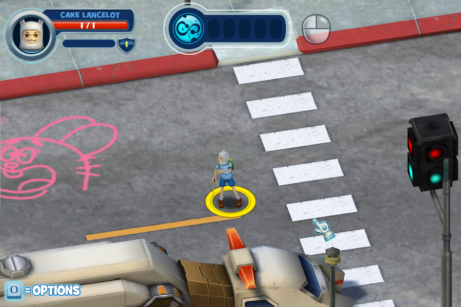

# HeroesExtension

An open-source SFS2X extension for FusionFall: Heroes.
Currently, it is in the proof-of-concept/"landwalker" stage, **don't expect a fully playable game**.

# Features
* Supports the latest build of the game (2013-07-01).
* Load into missions and explore with other players!

# Setup
> This guide assumes you already have a working SmartFoxServer2X installation.
> If you don't, there's a decent guide available [here](http://docs2x.smartfoxserver.com/GettingStarted/installation).
1. Either build the project yourself, or head to the releases page and grab HeroesExtension.jar and HeroesCommon.jar.
2. In your SFS2X directory, drop HeroesExtension.jar into `extensions/Heroes` and HeroesCommon.jar into `extensions/__lib__`. Create the folders if they don't exist yet.
3. Download the game's definition files (see [here](deploy/definitions/README.md) for instructions), then copy the `definitions` directory to `extensions/Heroes`. 
4. Head to the SFS2X admin tool, and create a new zone: name it `Heroes`. Inside the zone, make sure you have a default "lobby" room.
5. For the zone's extension, select `Heroes` for the name, `JAVA` as the type, and `net.cakelancelot.heroes.extension.HeroesZoneExtension` as the main class. **Do not configure extensions on a per-room basis!** When a room is dynamically created, the room extension will be assigned accordingly.
6. Connect to the server using the game client! Note that there is a hardcoded "service director" URL that prevents connecting out of the box. Instructions on how to modify your client to accept an arbitrary director URL will be provided soon.

# Contributing
This is my first major project in Java, so any pointers are appreciated. 
Pull requests for adding features are also welcome!

# Thanks to
* Kevman95 for the initial scrape of FusionFall Heroes.
* Danny O for the HD Dexlabs logo and info gathering.
* The rest of the crew in the Discord server for the support!

